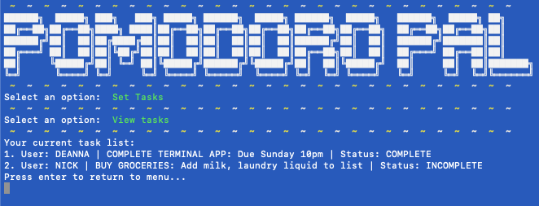

## PomodoroPal™
<em>Terminal Application (T1A3) by Deanna Nicdao</em>

### R3. References/sources
Ruby gems used in this application are referenced under section 'R10. Dependencies'. Sounds are attributed to the artists on https://freesound.org/ and are licensed under the Creative Commons Attribution License 3.0 (https://creativecommons.org/licenses/by/3.0/) for free distribution and adaptation:
* "Alarm" sound by <em>Kruf</em> (https://freesound.org/people/Kruf/sounds/528651/)
* "Exit" sound by <em>Antikore</em> (https://freesound.org/s/457195/)

### R4. Software Development Plan

All relevant files and directories are provided in the following GitHub repository:
#####[Click here for Github link](https://github.com/deannanicdao/pomodoro_ruby_app) or copy/paste the URL:
```http
https://github.com/deannanicdao/pomodoro_ruby_app
```
### R5. Purpose and Scope
Time is of the essence. This is why it's important that we optimise our productivity so we can minimise the time spent on work and more time on play. Minimising distractions is key for keeping focused during our bouts of productivity. This can be achieved when unnecessary distractions are put away including other screens (tablets, mobile devices and even smart watches).  Here, we aim to reduce the temptation of browsing the web, or looking at a smart screen with distracting notifications by introducing a minimalistic timer and task tracker.

To assist in achieving productivity, an interactive terminal application implementing the Pomodoro technique was developed. The Pomodoro technique created by Francesco Cirillo to encourage a productive work ethic. Time intervals dedicated to unbroken focus on work or study is typically set to 25 minutes followed by a 5 minute break. This is iterated three to five times or until tasks are completed. For further information on the philosophy behind the Pomodoro technique, check out the [wiki page](https://en.wikipedia.org/wiki/Pomodoro_Technique) and this [medium article](https://medium.com/the-crossover-cast/the-pomodoro-technique-the-tomato-inspired-productivity-philosophy-ad3ba4cb2cfe).

The Pomodoro Pal™ application includes three main features:
* Timer manager 
* Task manager 
* Automated Pomodoro sessions 

Users are able to create, edit and delete timers and tasks. With their selected timer, they are able to specify the number of cycles for their Pomodoro session. The aim is to guide the user's focus and work/rest balance on a time-basis. During the work period, the user will focus on completing tasks. Once the rest period, the user is encouraged to step away from their work space and break focus. This is cycled until all sessions have been completed. At the end, the user can access the task manager and tick off the completed tasks.

The target audience of this application include:

* Users who would like to achieve organised, timed sessions of work or study
* Managerial/teaching users who would like to time sessions for a group of users
* As this the time intervals can be varied, users can implement timed intervals into an activity, <em>e.g.</em> exercise/rest periods, cooking/check cooking time intervals, turn-based game timer

### R6. Features
The Pomodoro Pal™ application includes three main features:
* Timer manager 
* Task manager 
* Automated Pomodoro sessions 

Main menu:


Task lists can be edited and ticked off:


> <strong>Feature 1 </strong> 'Timed Pomodoro Sessions'
>Each Pomodoro session will run a work and rest timer consecutively. The user will be notified when each timer ends and when the total numbers of sessions have been reached. 
>- Choose the time length for each work/rest time interval in a Pomodoro session
>- Choose the number of sessions (cycles)
>- Session number/total sessions will be shown on the screen the when timers switch (<em>e.g.</em>, Session 1/5)
>- Audio alert is played when the timer is done
>- Users can select whether to: 
(a) return to menu after the Pomodoro session is complete 
(b) exit the application
>> Sub-feature: 'Clock display' | <em>Low Priority</em>
>>The current time will be viewed in the terminal application alongside the countdown feature during the Pomodoro session

> <strong>Feature 2 </strong> 'Timers'
> A list of timers that can be created, viewed and deleted.
>- Create timer option will prompt the user to input an integer value for the amount of minutes for each timer (work and rest)
>- View timer list will display a list of existing timers. If no timers have yet been set, the user will be returned to the main menu.
>- Delete timers option will prompt the user to select a timer to delete from a list of existing timers. Again, if no timers exist the user will be returned to the main menu.

> <strong>Feature 3 </strong> 'Task Manager'
> A list of tasks that can be created, viewed and deleted.
>- Create task option will prompt the user to input task title, task note and name
>- View task list will display a list of existing tasks. If no tasks have yet been set, the user will be returned to the main menu.
>- Change a task option will prompt the user to select an existing task from the list and reinsert a task title, task note and name
>- Delete tasks option will prompt the user to select a task to delete from a list of existing tasks. Again, if no tasks exist the user will be returned to the main menu.
>- Tick off a task option will prompt the user to select an existing task from the list and either tick or untick a task

### R7. User Experience and Interaction (UX/UI)
After running the installation instructions, the user will be directed to the main menu of Pomodoro Pal™. The main menu will contain a help option that can be selected using the arrow keys. Further instructions for each option in the app is described here.

If the user inputs an invalid value, the screen display message will provide a hint for the valid input required. 

><strong>An example UI/UX:</strong>
>1. User clones from github repository
>2. User runs the terminal command: sh run_me.sh
>3. Main menu is displayed and selects options using the arrow keys
>4. User creates timers using the arrow keys and enter to "Create timer"
>5. User is prompted to insert minutes for work timer followed by minutes for rest timer. User is returned to the main menu.
>6. User selects task manager and create task.
>7. User is prompted to enter a task title, task note and a name to assign the task to
>8. User selects to begin Pomodoro session.
>9. User is prompted to select a task from the list, task '1' is selected. 
>10. User is prompted to input a number of total sessions. User inputs 3.
>11. Confirmation to begin is asked. User confirms to begin and session starts.
>12. Work timer begins and remaining time is displayed on screen. Audio alert plays when timer ends.
>13. Rest timer begins and remaining time is displayed on screen. Audio alert plays when timer ends.
>14. This is repeated for the 3 cycles.
>15. End of all cycles, user is asked whether to return to main menu or exit the application.
>16. User returns to main menu.
>17. User selects task manager and open tick off task option 1.
>18. User selects task and ticks off task.
>19. Task list is shown on screen. User is returned to menu.
>20. User exits application.

### R8. Control Flow Diagram

The entire flowchart has been separated into components (features) and are shown below.
##### Start menu:


##### Task manager feature - create:


##### Task manager feature - read/update/delete:


##### Timer feature - create:


##### Timer feature - view:


##### Timer feature - delete:


##### Pomodoro Session:


### R9. Implementation Plan

#### Feature Implementations

> <strong>Feature 1 </strong> 'Timed Pomodoro Sessions' | <em>High Priority</em>
>Each Pomodoro session will run a work and rest timer consecutively. The user will be notified when each timer ends and when the total numbers of sessions have been reached. 
>- User will select a timer from existing timer list stored in array
>- User will input a number of sessions (cycles) before session starts, this will be the number of iterations for the timer loop (until session number reaches total sessions)
>- Audio alert is played when the timer is done using 'ruby2d' gem commands 
>- Countdown method will be called on the selected timer
>> Sub-feature: 'Clock display' | <em>Low Priority</em>
>>- Current time viewed on screen using Time class and sleep(1) to refresh per second

> <strong>Feature 2 </strong> 'Timers' | <em>High Priority</em>
>- Timer list will be an array; each timer is an array containing two integer elements (work time and rest time)
>- Input from user (min) will be converted to seconds
>- Countdown method with variables time_now and end_time to determine a session; key function being 'end_time = time_now + timer'
>- To implement CRUD of this list, the specific index will be targeted using array methods


> <strong>Feature 3 </strong> 'Task Manager' | <em>Medium Priority</em>
>- A list of tasks will be stored in a csv file (tasks.csv)
>- To implement CRUD, the CSV::Table is used to access each row like an array and will be accessed using their index


#### Project Management Platform
Trello board can be accessed [here](https://trello.com/b/ksciPUpE/pomodoro-pal) or copy/paste the URL below:
```http 
https://trello.com/b/ksciPUpE/pomodoro-pal 
```
Preview:

 


### R10. Help
#### Installation and Use

Pomodoro Pal is a command-line interface (CLI) application written using the Ruby language. 

ystem requirements: Computer with Ruby 2.0+ and terminal (Mac OS X, Terminal 2.10 was used to create this app).
Requisite Gems will be automatically installed via the instructions below. No other software or hardware requirements.
To access your terminal on mac OS, type '⌘ + space bar' for the macOS spotlight search. Type in 'terminal' into the search bar.
Press Enter.
Install Ruby (if unsure check this resource: https://www.ruby-lang.org/en/documentation/installation/) and click on the Github link (https://github.com/deannanicdao/pomodoro_ruby_app), download and extract the .zip file or insert the following command into your terminal (make sure you are in a desired directory):

```
$ git clone https://github.com/deannanicdao/pomodoro_ruby_app
```

In your terminal, navigate to the 'src' directory where the content has been downloaded. Some useful commands to navigate the terminal.

``` bash
pwd # check current location (directory)
ls # check items in current directory
cd [path] # move to a specific directory
```
Example change directory command:
```bash
cd Downloads/pomodoro_ruby_app/src
```
To start the app, type the following into the terminal:
```bash
sh run_me.sh
```
All dependencies should be automatically installed. Your terminal screen should now show the title screen and main menu. Here you can select the help menu for guidance on using the app. 

To reopen the app after exiting, simply run the command in your terminal while in the src directory:

```bash
ruby run.rb
```

#### Dependencies required by Pomodoro Pal

This application package includes a bundle kit which includes all the Ruby Gems utilised to run the application. 
> Ruby Gems used:
>* gem "rspec", "~> 3.9"
>* gem 'ruby2d'
>* gem 'pastel'
>* gem 'colorize'
>* gem 'tty-prompt'
>* gem 'tty-font'

### System/Hardware Requirements

This application is compatible across all platforms. Ruby version (2.7.1p83) was used when writing this application.

To check your current version, run this command in your terminal:
```bash
ruby -v
```

### Application Testing
Manual testing was implemented due to time constraints and is located in src/manual_testing.csv. See below for screenshot:

